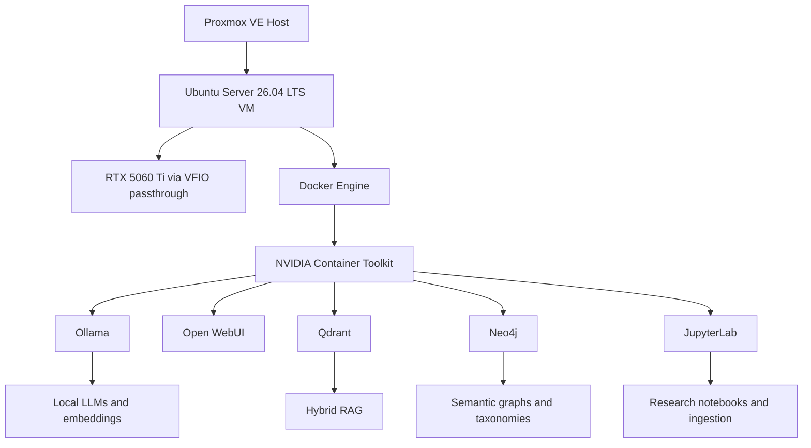

# Proxmox LAPAN AI Setup

Production-grade notes for a local AI research stack running on Proxmox with a GPU-passthrough Ubuntu Server VM.

## Target Architecture



## Current Status

Validated on 2026-05-21:

- Proxmox VE: 9.1.0, kernel `7.0.2-4-pve`.
- Ubuntu guest: Ubuntu Server 26.04 LTS, kernel `7.0.0-15-generic`.
- VM ID: `2020`; VM name: `lapan-ai`.
- VM CPU: `host`; AVX/AVX2/FMA/BMI features visible inside the VM.
- Proxmox storage: VM disks moved to `local-lvm`; root filesystem recovered to 10% usage.
- GPU passthrough: RTX 5060 Ti `[10de:2d04]` and audio function `[10de:22eb]` bound to `vfio-pci` on host and visible inside the VM.
- NVIDIA guest driver: `595.71.05`, CUDA reported by `nvidia-smi`: `13.2`.
- AI data disk: `/dev/sdb1` mounted at `/srv/ai`, 492G total with 480G available at validation time.
- Running local model set: `qwen3:8b`, `qwen2.5-coder:7b`, `bge-m3`, `embeddinggemma`.
- AI services bind to `127.0.0.1` except SSH on port 22.
- Jupyter base image tag: `JUPYTER_BASE_TAG=2026-05-11`.

See [Validated State](docs/00-project-context/03-validated-state-2026-05-21.md) for the measured output summary.

## Quick Start for Documentation Users

1. Read [Assumptions and Known Conflicts](docs/00-project-context/00-assumptions-and-known-conflicts.md).
2. Validate the host with `VMID=${VMID} scripts/gather_host_state.sh`.
3. Validate the VM with `scripts/gather_vm_state.sh` from inside Ubuntu.
4. Follow the chronological documentation map below.

## Documentation Map

### Context

- [Assumptions and Known Conflicts](docs/00-project-context/00-assumptions-and-known-conflicts.md)
- [Target Architecture](docs/00-project-context/01-target-architecture.md)
- [Security Model](docs/00-project-context/02-security-model.md)
- [Validated State — 2026-05-21](docs/00-project-context/03-validated-state-2026-05-21.md)

### Host Preparation

- [BIOS and Firmware](docs/01-proxmox-host/01-bios-and-firmware.md)
- [Host Networking](docs/01-proxmox-host/02-host-networking.md)
- [Host Boot and IOMMU](docs/01-proxmox-host/03-host-boot-and-iommu.md)
- [Host Storage](docs/01-proxmox-host/04-host-storage.md)

### VM and GPU

- [VM Creation](docs/02-ubuntu-vm/01-vm-creation.md)
- [Ubuntu Installation](docs/02-ubuntu-vm/02-ubuntu-installation.md)
- [VM Network and SSH](docs/02-ubuntu-vm/03-vm-network-and-ssh.md)
- [VM Filesystem Layout](docs/02-ubuntu-vm/04-vm-filesystem-layout.md)
- [VFIO Host Binding](docs/03-gpu-passthrough/01-vfio-host-binding.md)
- [Add GPU to VM](docs/03-gpu-passthrough/02-add-gpu-to-vm.md)
- [Guest NVIDIA Driver](docs/03-gpu-passthrough/03-guest-nvidia-driver.md)
- [NVIDIA Container Runtime](docs/03-gpu-passthrough/04-nvidia-container-runtime.md)

### Docker and AI Services

- [Docker Installation](docs/04-docker-and-services/01-docker-installation.md)
- [Compose Stack](docs/04-docker-and-services/02-compose-stack.md)
- [Service Validation](docs/04-docker-and-services/03-service-validation.md)
- [Model Management](docs/04-docker-and-services/04-model-management.md)

### Research Platform

- [RAG Architecture](docs/05-ai-research-platform/01-rag-architecture.md)
- [Embedding and Reranking](docs/05-ai-research-platform/02-embedding-and-reranking.md)
- [Semantic Graphs](docs/05-ai-research-platform/03-semantic-graphs.md)
- [Zotero Ingestion](docs/05-ai-research-platform/04-zotero-ingestion.md)
- [Local Agents](docs/05-ai-research-platform/05-local-agents.md)

### Operations and Troubleshooting

- [Backups and Restore](docs/06-operations/01-backups-and-restore.md)
- [Updates and Rollbacks](docs/06-operations/02-updates-and-rollbacks.md)
- [Monitoring and Logs](docs/06-operations/03-monitoring-and-logs.md)
- [Capacity Planning](docs/06-operations/04-capacity-planning.md)
- [Troubleshooting Index](docs/07-troubleshooting/01-proxmox-console-no-space-left.md)

## Repository Layout

```text
configs/      Sanitized config references
scripts/      State gathering, validation, and backup scripts
docs/         Phase-based deployment and operations documentation
archive/      Raw chat logs and pre-restructure drafts
```

## Security Baseline

- No cloud APIs for private or clinical data.
- No public service exposure by default.
- Bind AI service ports to `127.0.0.1` unless a reverse proxy and authentication policy are explicitly deployed.
- Keep Proxmox minimal: no NVIDIA driver, no AI services, no Tailscale unless intentionally reintroduced.
