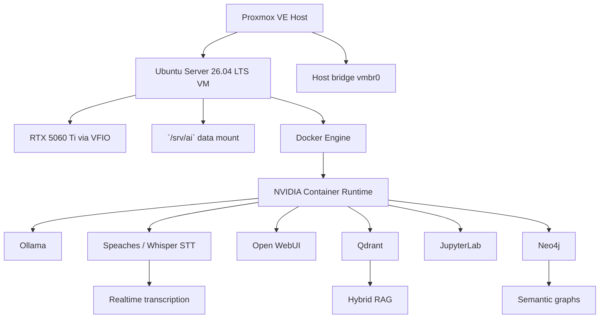

# Target Architecture

### 1. Objective & Prerequisites

- Defines the intended stable architecture for the local AI research stack.
- Required previous state: hardware selected, Proxmox installed, Ubuntu VM planned or running.
- Estimated time: 10 minutes. Risk level: none.



### 2. Step-by-Step Execution

**Step 1: Keep Proxmox minimal**
- **Purpose:** Reduce host failure modes by limiting Proxmox to virtualization, networking, storage, and VFIO.
- **Command(s):**
```bash
pveversion -v
qm list
pvesm status
```
- **Explanation:** These commands inspect the hypervisor without installing AI or NVIDIA runtime components on the host.
- **Expected Output:**
```text
proxmox-ve: ...
VMID NAME       STATUS ...
Name  Type  Status ...
```
- **Verification:** `dpkg -l | grep -Ei 'nvidia-driver|cuda|ollama|docker'` -> Should not show host-side AI runtime packages unless intentionally installed.
- **⚠️ Caveats/Traps:** Do not install NVIDIA drivers on the Proxmox host when the GPU is intended to belong to the VM.

**Step 2: Put all AI runtime inside Ubuntu**
- **Purpose:** Make the VM the single AI appliance and keep application state reproducible.
- **Command(s):**
```bash
ssh ${VM_USER}@${VM_IP}
df -h /srv/ai
sudo docker compose -f /srv/ai/compose/core/docker-compose.yml ps
```
- **Explanation:** This validates that AI services live inside the Ubuntu VM and use `/srv/ai` for persistent data.
- **Expected Output:**
```text
Filesystem      Size  Used Avail Use% Mounted on
/dev/...        ...   ...  ...   ...  /srv/ai
NAME            STATUS
ollama          Up ...
...
```
- **Verification:** `sudo docker info | grep 'Docker Root Dir'` -> Must show `/srv/ai/docker`.
- **⚠️ Caveats/Traps:** If Docker uses `/var/lib/docker`, model downloads can fill the VM root filesystem.

### 3. Configuration Files

Sanitized repo configuration lives in:

```text
configs/ai-stack/docker-compose.yml
configs/ai-stack/.env.example
configs/ubuntu-vm/docker-daemon.json
```

Live server configuration is deployed to:

```text
/srv/ai/compose/core/docker-compose.yml
/srv/ai/compose/core/.env
/srv/ai/compose/core/jupyter/Dockerfile
```

Use `scripts/deploy_ai_stack.sh` to sync repo configuration to the live path without overwriting existing secrets.

### 4. Troubleshooting & Recovery

- Host full: see [Proxmox console no space left](../07-troubleshooting/01-proxmox-console-no-space-left.md).
- VM root full: see [VM no space left](../07-troubleshooting/02-vm-no-space-left.md).
- GPU missing: see [GPU not visible in VM](../07-troubleshooting/03-gpu-not-visible-in-vm.md).
